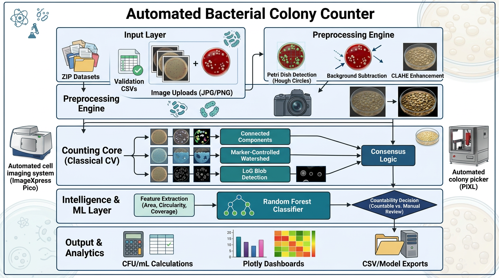
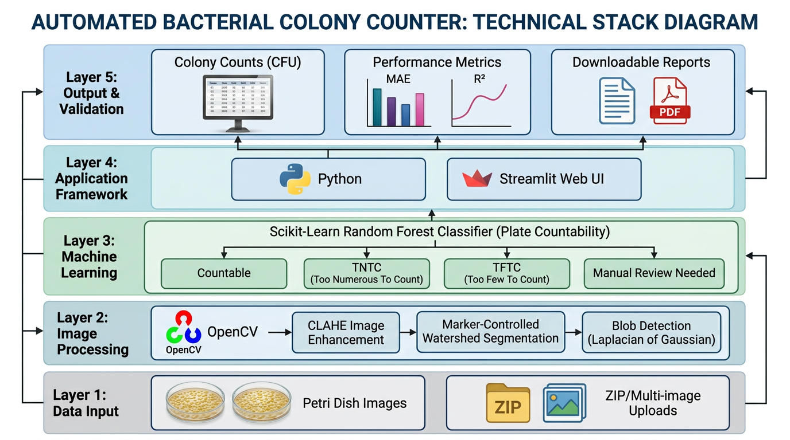

# 🧫 Team IntelliSphere - Automated Bacterial Colony Counter
**AVIT Faculty Hackathon 2026 — Project 07**  

**Classical Computer Vision Colony Counter + Random Forest Countability Classifier**
CSE × Biotechnology Interdisciplinary Team
[](https://colony-counterintellisphere-3ftifsae7c8z9urjof27qj.streamlit.app/)
<a href="https://colony-counterintellisphere-3ftifsae7c8z9urjof27qj.streamlit.app/" target="_blank">
  
</a>
> **Developed for the AVIT Faculty Hackathon 2026**

A research-oriented application developed as part of the **AVIT Faculty Hackathon 2026**, demonstrating the use of **classical computer vision** and **machine learning** for automated bacterial colony counting and laboratory validation. The system performs deterministic colony counting using robust image processing techniques, while a lightweight Random Forest classifier determines whether a plate is suitable for automatic counting or should be referred for manual review.

---
# 🧫 Automated Bacterial Colony Counter

> **Developed for the AVIT Faculty Hackathon 2026**


---

# 🏆 AVIT Faculty Hackathon 2026

## Event Information

| Item                     | Details                                                          |
| ------------------------ | ---------------------------------------------------------------- |
| **Event**                | AVIT Faculty Hackathon 2026                                      |
| **Institution**          | Aarupadai Veedu Institute of Technology (AVIT)                   |
| **University**           | Vinayaka Mission's Research Foundation (Deemed to be University) |
| **Department**           | Department of Computer Science and Engineering                   |
| **Problem Statement**    | Automated Bacterial Colony Counter                               |
| **Application Domain**   | Artificial Intelligence for Biotechnology                        |
| **Technology Stack**     | Classical Computer Vision + Machine Learning                     |
| **Platform**             | Streamlit                                                        |
| **Programming Language** | Python                                                           |

---

# 📖 Project Overview

Manual bacterial colony counting is a routine laboratory procedure used in microbiology, biotechnology, food safety, environmental monitoring, pharmaceutical quality control, and clinical diagnostics. Traditionally, microbiologists visually inspect petri dishes and manually count bacterial colonies. Although simple, this process is:

* Time consuming
* Labour intensive
* Subjective
* Prone to human error
* Difficult to reproduce consistently across different operators

The challenge becomes even greater when colonies overlap, lighting conditions vary, or images contain reflections and background artifacts.

To address these limitations, this project presents an **Automated Bacterial Colony Counter** based primarily on **Classical Computer Vision (CV)**. Unlike many recent approaches that rely entirely on deep learning, this solution performs colony counting using deterministic image processing techniques that require **no training data** for the counting task.

The application further integrates a lightweight **Random Forest Machine Learning classifier** whose sole purpose is to determine whether a plate should be automatically counted or flagged for manual review.

This design satisfies the hackathon requirement of separating deterministic colony counting from machine learning-based plate assessment.
## 📂 Dataset

The bacterial colony image dataset used for validation can be downloaded from Google Drive:

**Dataset:** https://drive.google.com/file/d/1XkhysS1V2OOpCol5UgsncJ240Hh4S9au/view?usp=sharing

---

# 🎯 Problem Statement

Develop an intelligent application capable of automatically counting bacterial colonies from petri-dish images using **Classical Computer Vision** techniques while simultaneously predicting whether a plate is suitable for automatic counting or requires manual inspection.

The solution must:

* Count bacterial colonies accurately
* Separate touching colonies
* Handle lighting variations
* Work on real laboratory images
* Compare baseline and improved segmentation techniques
* Validate results against manual laboratory counts
* Use Machine Learning only for plate-level decision making
* Produce quantitative evaluation metrics
* Provide an easy-to-use web application

---

# 🚀 Objectives

The major objectives of this project are:

### Primary Objectives

* Automatically detect petri dishes.
* Remove background and unwanted reflections.
* Enhance image quality.
* Segment bacterial colonies accurately.
* Separate touching colonies using Marker-Controlled Watershed.
* Count colonies automatically.
* Estimate CFU values.
* Compare automated counts with laboratory manual counts.

### Secondary Objectives

* Develop a Random Forest classifier for plate-level countability prediction.
* Compare baseline and improved segmentation algorithms.
* Evaluate robustness under different illumination conditions.
* Generate downloadable validation reports.
* Develop an interactive Streamlit application suitable for laboratory use.

---
# 🌐 Live Web Application

The Automated Bacterial Colony Counter is publicly available through **Streamlit Community Cloud**.

### 🚀 Launch the Application

👉 **https://colony-counterintellisphere-3ftifsae7c8z9urjof27qj.streamlit.app/**

No installation is required.

---

## ▶️ How to Use

1. Open the Streamlit application.
2. Upload one or more Petri plate images or a ZIP archive.
3. (Optional) Upload the laboratory validation CSV containing:
   ```
   filename,manual_count,countability_label
   ```
4. Select the desired colony counting method.
5. Configure image processing parameters if required.
6. Click **Process All Images**.
7. Review:
   - 🧫 Automatic Colony Count
   - 🤖 Countability Prediction
   - 🧪 CFU Estimation
   - 📊 Validation Metrics
   - 📈 Baseline Comparison
   - 🔬 Robustness Analysis
8. Download the generated CSV reports.

---

## 💻 Google Colab (Alternative)

For developers and researchers, the complete project can also be executed using the provided notebook:

`Automated_Bacterial_Colony_Counter_InteeliSphere_Project.ipynb`

The notebook automatically:

- Installs all required dependencies
- Creates the Streamlit application
- Starts the Streamlit server
- Generates a temporary Cloudflare public URL

---

## 📋 Recommended Usage

| Platform | Recommended For |
|----------|-----------------|
| **Streamlit Community Cloud** | Hackathon judges, end users, demonstrations |
| **Google Colab Notebook** | Developers, researchers, experimentation |

> **Recommendation:** Use the **Streamlit Community Cloud** deployment for evaluating and demonstrating the application. The **Google Colab** notebook is intended for reproducing experiments, modifying the source code, and development.

# 💡 Key Features

## Image Handling

* Single image upload
* Multiple image upload
* ZIP upload
* Large ZIP processing
* Google Colab compatibility
* Automatic ZIP indexing

---

## Classical Computer Vision

* Automatic petri plate localization
* Agar masking
* Reflection removal
* Background subtraction
* CLAHE enhancement
* Adaptive thresholding
* Otsu thresholding
* Morphological filtering
* Distance transform
* Marker-Controlled Watershed
* Connected Components baseline
* Laplacian of Gaussian detector
* Consensus colony counting
* Colony feature extraction
* Duplicate suppression

---

## Machine Learning

Random Forest classifier for

* Countable
* Too Few To Count (TFTC)
* Too Numerous To Count (TNTC)
* Manual Review

---

## Validation

* Manual count comparison
* MAE
* MAPE
* Accuracy
* R² Score
* Absolute Error
* Percentage Error

---

## Baseline Comparison

The application compares four independent counting approaches.

| Method                      | Purpose             |
| --------------------------- | ------------------- |
| Connected Components        | Baseline Method     |
| Marker-Controlled Watershed | Improved Method     |
| Laplacian of Gaussian       | Blob Detection      |
| Consensus Counter           | Combined Prediction |

---

## Robustness Evaluation

The application automatically evaluates the effect of

* Low illumination
* High illumination
* Image noise

and reports deviations in colony counts.

---
# 🔬 System Workflow

<p align="center">
  
</p>

<p align="center">
<b>Figure 1.</b> Overall architecture of the Automated Bacterial Colony Counter.
</p>

<p align="center">
  
</p>
<p align="center">
<b>Figure.</b> Technology stack used in the Automated Bacterial Colony Counter.
</p>

```text
Petri Plate Image
        │
        ▼
Petri Plate Detection
        │
        ▼
Agar Mask Generation
        │
        ▼
Background Removal
        │
        ▼
Contrast Enhancement (CLAHE)
        │
        ▼
Thresholding
        │
        ▼
Morphological Cleaning
        │
        ▼
Distance Transform
        │
        ▼
Marker Generation
        │
        ▼
Marker-Controlled Watershed
        │
        ▼
Colony Filtering
        │
        ▼
Duplicate Removal
        │
        ▼
Automatic Colony Count
        │
        ▼
Validation Against Manual Count
        │
        ├────────► Performance Metrics
        │
        └────────► Random Forest
                    Countable /
                    Manual Review
```

---

# 📊 Performance Evaluation

The system provides comprehensive evaluation including:

### Colony Counting

* Mean Absolute Error (MAE)
* Mean Absolute Percentage Error (MAPE)
* Count Accuracy
* R² Score

### Classification

* Accuracy
* Precision
* Recall
* F1 Score
* Confusion Matrix
* Classification Report

### Robustness

* Dark image analysis
* Bright image analysis
* Noisy image analysis

---

# 🌟 Novel Contributions

* Deterministic colony counting without deep learning.
* Marker-Controlled Watershed segmentation for separating touching colonies.
* Random Forest used exclusively for plate-level decision making.
* Automatic validation against laboratory counts.
* Baseline comparison using multiple counting algorithms.
* Robustness evaluation under varying imaging conditions.
* Interactive Streamlit dashboard with parameter tuning.
* Large-scale batch processing of laboratory datasets.
* Downloadable validation reports for research and publication.

---

# 🎯 Expected Applications

* Microbiology laboratories
* Biotechnology research
* Food microbiology
* Pharmaceutical quality control
* Clinical microbiology
* Environmental monitoring
* Academic research laboratories
* Educational demonstrations
* AI-assisted laboratory automation

---

# 👩‍💻 Developed For

**AVIT Faculty Hackathon 2026**
## 👥 Team Members and Responsibilities

| Team Member                                                                                         | Role                                                    | Responsibilities                                                                                                                                                                                                                                                                                                                                                                                                                                                                                                                                                       |
| --------------------------------------------------------------------------------------------------- | ------------------------------------------------------- | ---------------------------------------------------------------------------------------------------------------------------------------------------------------------------------------------------------------------------------------------------------------------------------------------------------------------------------------------------------------------------------------------------------------------------------------------------------------------------------------------------------------------------------------------------------------------- |
| **Dr. S. Pitchumani Angayarkanni**<br>Professor – Department of Computer Science and Engineering    | **Team Leader, AI & Computer Vision Architect**         | • Conceived the project and designed the overall system architecture.<br>• Developed the classical computer vision pipeline for automated bacterial colony counting.<br>• Designed Petri plate detection, image preprocessing, marker-controlled watershed segmentation, colony filtering, and validation methodology.<br>• Developed the Random Forest-based countable vs. manual-review classifier.<br>• Led experimental design, performance evaluation, robustness analysis, technical documentation, GitHub repository preparation, and technical report writing. |
| **Mr. R. Udaya**<br>Assistant Professor – Department of Computer Science and Engineering            | **Software Development & Visualization Lead**           | • Developed the Streamlit-based interactive web application.<br>• Implemented image upload, ZIP processing, and large dataset handling modules.<br>• Designed interactive dashboards, visualization components, parameter tuning interface, and report generation.<br>• Integrated computer vision algorithms with the user interface.<br>• Assisted in software testing, debugging, deployment, and performance optimization.                                                                                                                                         |
| **Dr. Baskar**<br>Assistant Professor – Department of Humanities & Sciences (Mathematics)           | **Statistical Validation & Performance Analytics Lead** | • Validated statistical evaluation methods and performance metrics.<br>• Designed and verified MAE, MAPE, Accuracy, Precision, Recall, F1-score, R², and confusion matrix analysis.<br>• Evaluated baseline versus improved segmentation methods using quantitative metrics.<br>• Contributed to robustness analysis, experimental validation, and statistical interpretation of results.                                                                                                                                                                              |
| **Dr. A. Keerthi**<br>Assistant Professor – Department of Electronics and Communication Engineering | **Quality Assurance & Experimental Validation Lead**    | • Conducted experimental validation using real bacterial colony images.<br>• Verified colony counting accuracy through comparison with manual laboratory counts.<br>• Evaluated the system under varying illumination, image noise, and colony density conditions.<br>• Assisted in robustness testing, quality assurance, performance evaluation, documentation, and demonstration preparation.                                                                                                                                                                       |

---

## 🧫 Domain Expert Validation

| Domain Expert                                                                                                       | Role                                        | Responsibilities                                                                                                                                                                                                                                                                                                                                                                                                                                                                                                                                                                                                                             |
| ------------------------------------------------------------------------------------------------------------------- | ------------------------------------------- | -------------------------------------------------------------------------------------------------------------------------------------------------------------------------------------------------------------------------------------------------------------------------------------------------------------------------------------------------------------------------------------------------------------------------------------------------------------------------------------------------------------------------------------------------------------------------------------------------------------------------------------------- |
| **Dr. S. Kalaivani Priyadarshini**<br>Associate Professor – Department of Biotechnology, Lady Doak College, Madurai | **Domain Expert & Microbiology Validation** | • Validated the biological relevance of the automated colony counting methodology.<br>• Reviewed Petri plate image interpretation and microbiological counting procedures.<br>• Verified the classification criteria for Countable, TFTC (Too Few To Count), and TNTC (Too Numerous To Count) plates according to standard microbiological practices.<br>• Evaluated the laboratory validation strategy, performance metrics, and practical applicability of the system for microbiology and biotechnology laboratories.<br>• Provided expert recommendations to improve the biological accuracy and usability of the developed application. |


## 📂 Project Resources

Access all project deliverables from the links below.

| 📌 Resource                             | 🔗 Link                                                                                                                                 |
| --------------------------------------- | --------------------------------------------------------------------------------------------------------------------------------------- |
| 🧫 **Prototype (Live Web Application)** | https://colony-counterintellisphere-3ftifsae7c8z9urjof27qj.streamlit.app/                                                               |
| 📹 **Demo Video**                       | https://drive.google.com/file/d/1Uy4Dcpdv9KbdlUY_x7gmYjy-eQjYKlxB/view?usp=sharing                                                      |
| 📄 **Technical Report**                 | https://drive.google.com/file/d/1C92yKm847TlNAdrz7_mk2W-Dr9vVcfLB/view?usp=sharing                                                      |
| 📊 **Project Presentation**             | https://docs.google.com/presentation/d/1nAr53HhZ-50ZK1HgH_-G1kb3fq05GTpU/edit?usp=sharing&ouid=106817736780012115323&rtpof=true&sd=true |

### 📦 Deliverables

* 🧫 Interactive Streamlit Prototype
* 📹 Complete Project Demonstration Video
* 📄 Technical Report (Methodology, System Architecture, Experimental Results, Validation, Robustness Analysis, and Limitations)
* 📊 Final Hackathon Presentation
* 💻 Complete Source Code and Documentation

